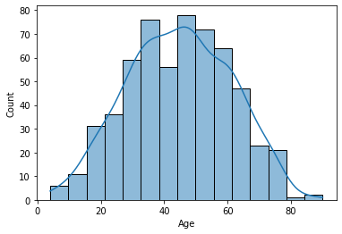
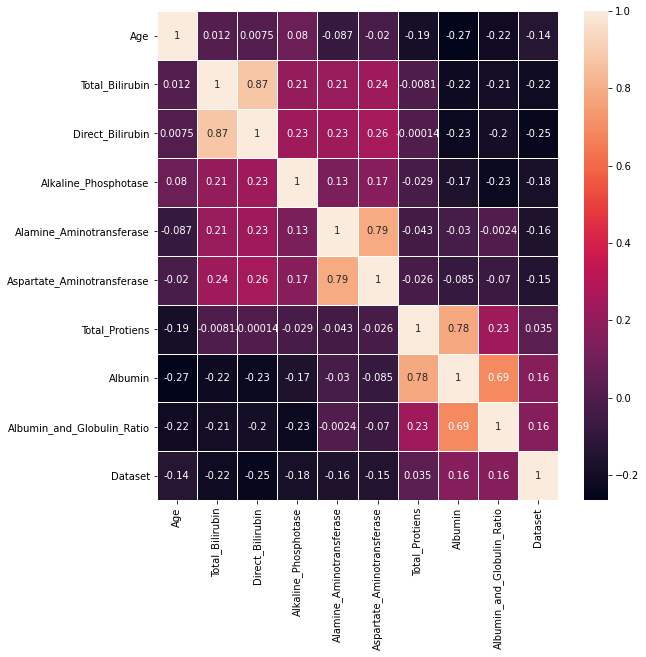
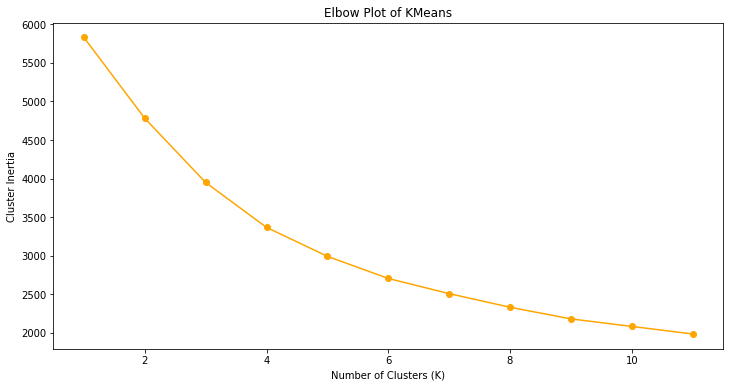
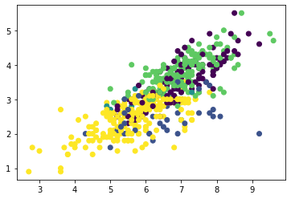

# Liver Disease Prediction

A machine learning project focused on predicting liver disease using patient clinical data. This project was completed as part of my internship at **Postulate Infotech** and demonstrates data preprocessing, exploratory data analysis, feature correlation analysis, clustering, and predictive modeling using Python.

---

## Project Overview

Early detection of liver disease can assist healthcare professionals in making timely clinical decisions. This project analyzes patient health records to identify patterns associated with liver disease through exploratory data analysis, feature engineering, clustering, and machine learning techniques.

---

## Dataset

- **Source:** Kaggle
- **Domain:** Healthcare
- **Task:** Liver Disease Prediction

The dataset contains patient demographic information and liver function test results, including:

- Age
- Gender
- Total Bilirubin
- Direct Bilirubin
- Alkaline Phosphotase
- Alamine Aminotransferase
- Aspartate Aminotransferase
- Total Proteins
- Albumin
- Albumin and Globulin Ratio

---

## Internship

This project was completed during my internship at **Postulate Infotech Pvt. Ltd.** as part of a machine learning training program focused on applying data science techniques to healthcare datasets.

---

## Project Workflow

- Data Loading
- Data Cleaning & Preprocessing
- Exploratory Data Analysis (EDA)
- Feature Correlation Analysis
- K-Means Clustering
- Predictive Modeling
- Result Analysis

---

## Repository Structure

```text
Liver-Disease-Prediction/
│
├── README.md
├── LICENSE
├── requirements.txt
├── .gitignore
├── liver_disease_prediction.ipynb
├── indian_liver_patient.csv
└── images/
    ├── age_distribution.png
    ├── correlation_heatmap.png
    ├── elbow_plot.png
    └── kmeans_clusters.png
```

---

## Features Used

- Age
- Gender
- Total Bilirubin
- Direct Bilirubin
- Alkaline Phosphotase
- Alamine Aminotransferase
- Aspartate Aminotransferase
- Total Proteins
- Albumin
- Albumin and Globulin Ratio

---

## Exploratory Data Analysis

The project includes exploratory analysis to better understand the dataset and identify important relationships between medical attributes.

### Age Distribution

<p align="center">
  
</p>

Distribution of patient ages within the dataset.

---

### Correlation Heatmap

<p align="center">
  
</p>

Correlation matrix illustrating relationships between clinical features.

---

### K-Means Elbow Plot

<p align="center">
  
</p>

Elbow method used to estimate an appropriate number of clusters for K-Means clustering.

---

### K-Means Clustering

<p align="center">
  
</p>

Visualization of patient groups identified through K-Means clustering based on clinical features.

---

## Machine Learning Techniques

- Data Preprocessing
- Feature Analysis
- Correlation Analysis
- K-Means Clustering
- Predictive Modeling

---

## Key Highlights

- Performed exploratory analysis on liver disease patient data.
- Visualized relationships between multiple clinical features.
- Applied K-Means clustering to identify patterns within the dataset.
- Explored healthcare data using machine learning techniques.
- Completed as part of a machine learning internship project.

---

## Tech Stack

- Python
- Pandas
- NumPy
- Matplotlib
- Seaborn
- Scikit-learn
- Jupyter Notebook

---

## Future Improvements

- Compare multiple supervised machine learning algorithms.
- Perform hyperparameter tuning for improved predictive performance.
- Evaluate additional healthcare datasets.
- Deploy the prediction model as a web application.

---

## License

This project is licensed under the MIT License. See the **LICENSE** file for details.
